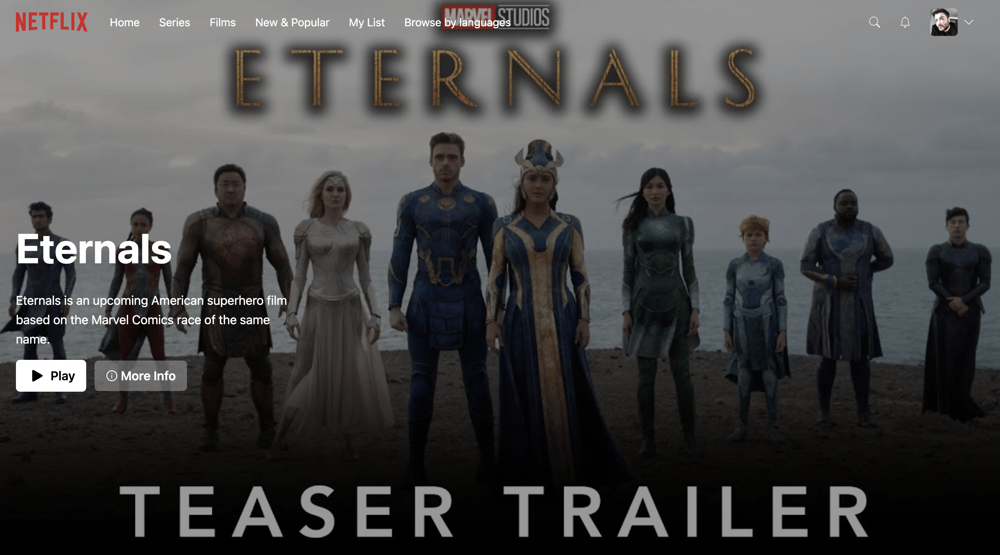
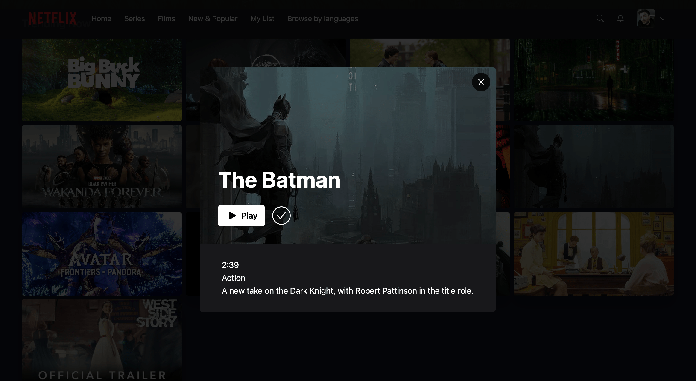
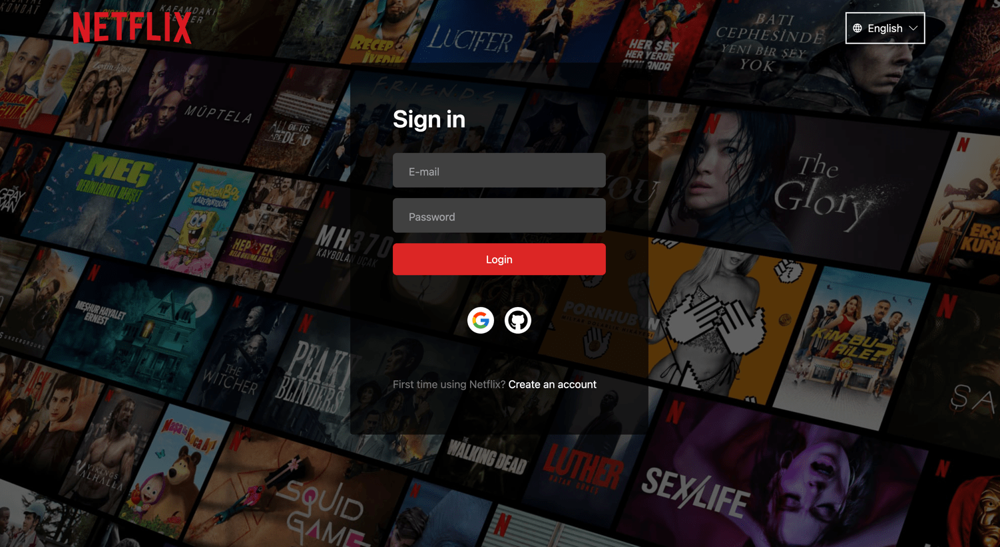
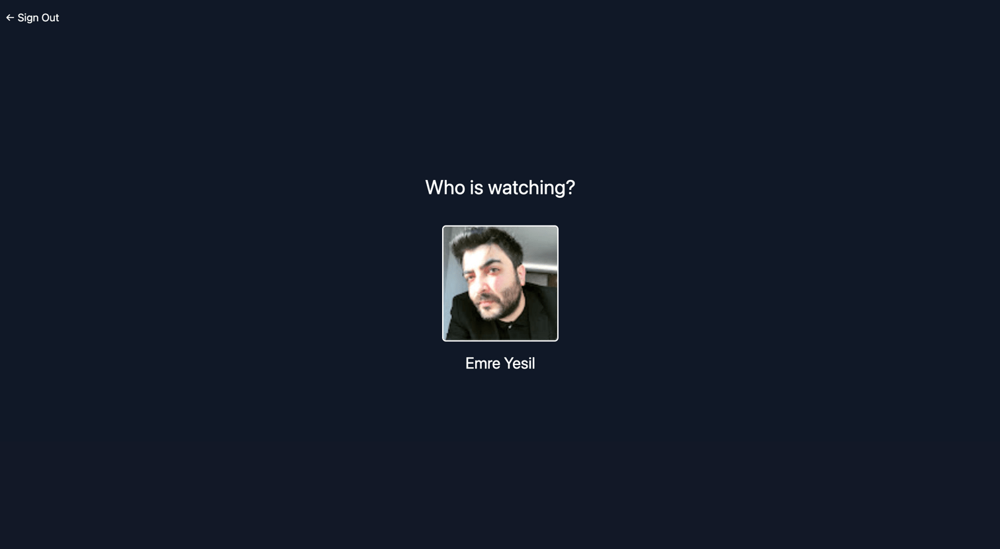
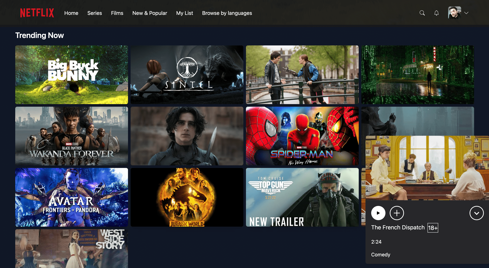

# Netflix Clone Project

This project is a Netflix clone built using Next.js, React, and Node.js. It is designed to showcase a list of popular movies and TV shows, their information, and related videos. 

## How to run this project on your computer

To run this project on your computer, follow these steps:

### Prerequisites

Before running this project, you will need the following software installed on your computer:

- Node.js
- npm or yarn

### Installation

1. Clone this repository to your local machine using `git clone https://github.com/nhtmrys/netflix-clone-project.git`
2. Navigate to the root directory of the project using `cd netflix-clone-project`
3. Install the required dependencies using `npm install` or `yarn install`

### Running the project

1. Run the project in development mode using `npm run dev` or `yarn dev`
2. Open a web browser and go to `http://localhost:3000`

### Building the project

1. To build the project, run `npm run build` or `yarn build`
2. To start the production server, run `npm start` or `yarn start`

## Screenshots

Below are some screenshots of the project:

## Contributing

We welcome contributions to this project. To contribute, please fork the repository and submit a pull request.
